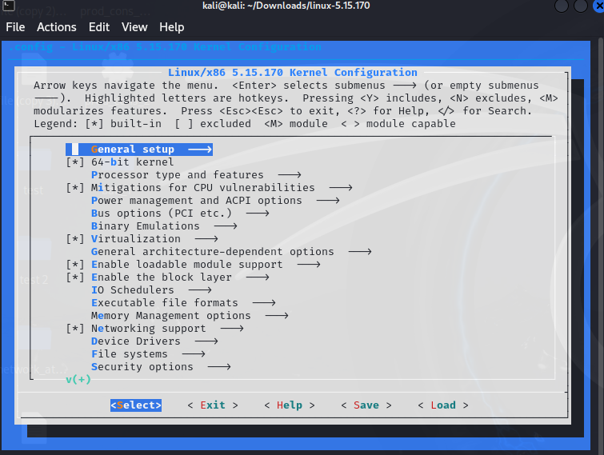
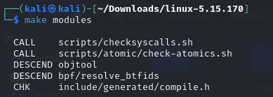

# **1.Source Code Download:**

> ## **1.1 Download Methods**

I downloaded the kernel from the Official Kernel Archive. I prefer
official sources for their straightforward download process and
user-friendly interface compared to GitHub.

-   he kernel version: linux-5.15.170

### **1.2 Source Code Structure**

**1. Key Directories and Their Purpose:**

-   **arch/:** Architecture-specific code (e.g., x86, ARM).

-   **drivers/:** Kernel device drivers for hardware components.

-   **include/:** Header files for various kernel components.

-   **kernel/:** Core kernel code (scheduling, system calls, etc.).

-   **Documentation/:** Documentation for the kernel and its components.

-   **Makefile:** The build configuration and compilation instructions
    for the kernel.

**2. Chosen Hardware: USB Network Adapter**

For my hardware, a USB network adapter, the relevant driver is located
in the drivers/usb/net/ directory. Specifically, the driver I need is
found in the usbnet.c file. This driver is used for USB network
adapters, ensuring that my device can communicate with the system via
the USB interface. I found this by searching the drivers/usb/ directory
for the usbnet driver, which is commonly used for such devices.

# **2.Kernel Configuration:**

**1. Choose and Justify Your Configuration Method**

-   **Choice**: I will use the **menu-based configuration** (make
    menuconfig).

-   **Justification**: I prefer this method because it provides an
    interactive, visual approach to selecting kernel options. It's
    especially useful for understanding the dependencies between options
    and ensures that I only select the features I need.

Here I can change Options:

 **y (yes)**: The feature is built into the kernel.

 **m (module)**: The feature is built as a loadable kernel module.

 **n (no)**: The feature is disabled and not included in the kernel.

For specific changes I use "grep" commands:

**Processor Architecture:**

-   **CONFIG_X86_64**: For 64-bit x86 architecture support.

    -   **Justification**: Necessary for enabling support for the x86-64
        architecture in the kernel.

**Basic File Systems:**

-   **CONFIG_EXT4_FS**: For enabling EXT4 file system support.

    -   **Justification**: EXT4 is one of the most common file systems
        used on Linux and is often required for root and data
        partitions.

**Essential Device Drivers**:

-   **Option**: CONFIG_USB_SUPPORT

-   **Justification**: This option enables USB support in the kernel,
    which is essential for recognizing and working with USB devices like
    flash drives, mice, and keyboards.

**Core Kernel Features**:

-   **Option**: CONFIG_NETFILTER

-   **Justification**: Enables network filtering capabilities, which are
    important for firewall functionality and network security.

**Networking**:

-   **Option**: CONFIG_TCP_CONG_CUBIC

-   **Justification**: TCP Cubic is the default congestion control
    algorithm used in modern Linux kernels, providing efficient network
    performance, especially for high-speed networks.

**Security**:

-   **Option**: CONFIG_SECURITY_SELINUX

-   **Justification**: SELinux is a security module that enhances the
    security of the system by enforcing mandatory access controls.

**Virtual Memory**:

-   **Option**: CONFIG_HIGHMEM

-   **Justification**: This option enables support for high memory,
    which allows the system to access more than 4 GB of RAM on 32-bit
    systems.

**Sound Drivers**:

-   **Option**: CONFIG_SND_HDA_INTEL

-   **Justification**: This option enables Intel HD audio support,
    providing functionality for audio on systems using Intel chipsets.

**Graphics Drivers**:

-   **Option**: CONFIG_DRM

-   **Justification**: DRM support is necessary for modern graphics
    hardware, enabling features like accelerated graphics and support
    for display managers.

**System Timing**:

-   **Option**: CONFIG_HZ_1000

-   **Justification**: This setting increases the system timer frequency
    to 1000 Hz, which is important for systems requiring high precision
    timing, such as real-time applications.

# **3.Kernel Compilation:**

## **1.Cleaning Previous Builds**:

    -   Used 'make clean' to remove old build files.

> 

-   Used 'make mrproper' for a thorough clean (backed up the .config
    file).

> 

## **2.Compiling the Kernel**:

We use the 'menuconfig' for create
        .config file

-   Run 'make' in the kernel source directory.

-   Kernel compilation took approximately X hours (depends on your
        system). it's took 5h execution for me.

## **3.Compiling and Installing Modules**:

    -   Run 'make modules' to compile the kernel modules.

> 

-   Installed modules using 'make modules_install'.

> 

## **4.Kernel Installation:**
>
> After compiling the kernel, you need to install it so the system can
> boot using it.

### **1.Run the install command**:

### **2.Updating the Bootloader**

Once the kernel is installed, update the bootloader to recognize the new
kernel.

### **3.Creating the Initial RAM Disk (initrd)**

The initial RAM disk (initrd) provides the
kernel with essential drivers before accessing the actual file system.

-   The -c flag creates the 'initrd' for the specified kernel version
    (5.15.170).

-   'Initrd' file will be saved in '/boot' as initrd.img-5.15.170.

